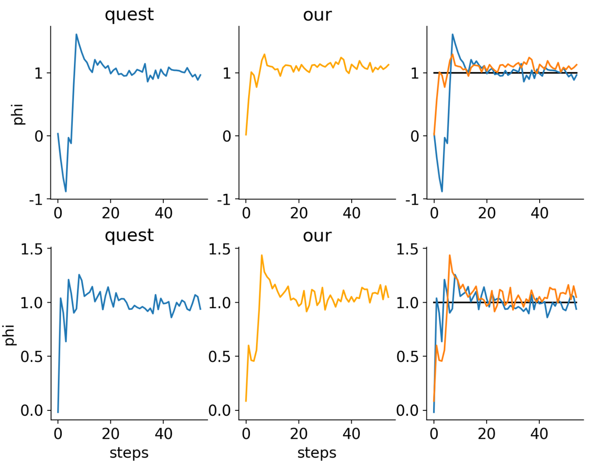

# Todo

- implement part 2 for complex task
- think about demo task. ideally we want to show it in something like cartpole.
- cartpole add more noise?

# Current result
rrn baseline: good. cost doesnt matter but cost makes theta length matter

rnn prob: good, with gradient clip. 

inferrence as inverse: good. need about 30 len trajectory and does one shot inverse.
need some noise to make this slightly harder, but not too much harder for a demo task.

some math proofs

achieve near identical performance as QUEST, a proven opitmal method in psychophysics tasks.


# Proposal

## Introduction

### Background
Based on the idea of inverse rational control (IRC), we can assume the subject or agent to be suboptimal but still rational. 
The suboptimality generally comes from wrong assumptions of the actual task dynamics and control preferences. It can also come from biological limitations such as representation and computation cost, but this has not been modeled in the current version of IRC. 
When compared to other inverse reinforcement learning methods, IRC has three benefits in the neuroscience/cognition field. 
First, we do not assume subjects to be near optimal but rather rational with individual differences. 
Second, IRC infers latent assumptions instead of a hard-to-interpret reward function and policy. 
Third, IRC can handle complex problems, while some inverse optimal control methods achieve the first two benefits but can only be applied to simple problems.

### Goal
However, there are some limitations to inverse rational control (IRC) that need to be considered. 

Firstly, IRC relies on solving the partially observable Markov decision process (POMDP) in the reverse order, which often involves sampling and marginalization. 
The inverse model is not pre-exposed to the samples, and we have to do this for each piece of data to evaluate the likelihood. 
This brings up efficiency concerns.

Secondly, IRC needs quite a lot of data to start running. 
For one trial data, we won't be able to update our theta estimation in a meaningful way. This is similar to random exploration.


### Proposed way
Here, I propose a potential upgrade to solve these two problems. 
I believe the fundamental problem is sampling. 
We currently use the likelihood function and the actual data to check if the current theta estimation reproduces samples that are similar to the actual data. 
This process is inefficient since we have to evaluate the likelihood for each piece of data.

To address this, we can use a model that learns the pattern of the theta estimation ahead of time. 
This way, we can directly evaluate the likelihood without doing more samples. Additionally, with this model, we will be able to select the best task to better infer the theta. 
This model should take the trajectory time series input and output the inferred theta. The model will twist the hidden representation of the trajectory manifold into a uniform grid theta and phi. 
There exists a recurrent submodel that holds a representation of the time series. Using this submodel, we can embed the trial data and calculate the information content of theta offered by a task phi. 
Selecting a max information task phi could potentially accelerate the IRC.

If we think of the inverse problem as a learning problem, we can view the subject as the environment and experimenters as the agent, trying to build a subject model (like the world model in Dreamer RL) from the interactions. 
Most previous methods assume that the data is precollected in the replay buffer, so it's like the agent is passively learning and not actively exploring in this setup. 
However, we know from RL that once the agent develops an inaccurate imaginary world model, active learning is almost a must to learn efficiently. 
Here, I believe that for this inverse problem, we are not starting from scratch, and active learning can greatly accelerate the learning process.

In summary of this new approach, we use the network inference as the inverse (likelihood function) and update the estimation of theta (Bayesian optimization), and solve a smaller optimization problem to select the best phi in terms of information. 
We perform these two steps iteratively until convergence.


# Methods

## Notations

- $^*$ stands for actual data/ground truth data
- $\hat{}$ stands for estimations
- $\theta$  latent assumptions of the task
- $\phi$ task configurations
- $T$ time series trajectories data

## Part 1, inference as inverse
Let $F$ be a neural network, reverse function of POMDP, such that 

$$ F(T_{\theta,\phi}, \phi) = Decoder(Encoder(T_{\theta,\phi},\phi)) = p(\theta) $$

the output of the function $F$ is probobalistic:

$$\theta \sim N(\mu_{\theta}, \Sigma_{\theta})$$

the objective function is given by:


$$ \arg\min_{\phi} \;\; \left \langle {\text{KL}\left(\; p(\theta \mid \theta^*) \;\middle\|\; q(\theta \mid T_{\theta^*,\phi}, \phi) \;\right)} \right \rangle_{T,\theta^*} $$


usually we do not model $p(\theta\mid \theta^*)$. 
instead, $p(\theta\mid \theta^*)$ naturally exist because due to stochasity there are some other $\theta$ (usually nearby) besides $\theta^*$ can produce the same trajectory $T$.

the objective function is to minimize the KL divergence of such $p(\theta \mid \theta^*)$ distribution (targets) and the network's predicted $p(\theta)$ distribution given the trajectories (input data). 
the objective function averages over two things.
first, it averages over the different samples of $T \mid \theta^*,\phi$.
second, it averages over the entrire possible assumptions range, $\theta^* \sim \Theta$.

most of the time we just model the $p(\theta\mid \theta^*)$ to be a delta distribution.
instead of using KL divergence we just maximize the probabiliy of $\theta^*$ in $p(\theta) = F(T_{\theta,\phi}, \phi)$ which is a gaussian distribution $N({\mu}_{\theta}, {\Sigma}_{\theta})$.

$$ p(\theta = \theta^*) =$$

$$ p(\theta^* \mid N(\mu_{\theta}, \Sigma_{\theta})) = \frac{1}{\sqrt{(2\pi)^n \det(\Sigma_{\theta})}} \exp\left(-\frac{1}{2}(\theta^* - \mu_{\theta})^T \Sigma_{\theta}^{-1} (\theta^*-\mu_{\theta})\right) $$ 


minimizing the negative log probabiliy over all $p(\theta^*)$ yields the trained function $F$.

explain:
the idea is really like the variational autoencoder.
the input is the trajectories $T$, and the latent variable is the $\theta$.
in this case, we do not have to reconstruct to the oringal input because we known the latent space already.
we know exactly $p(\theta)$ and $p(T\mid \theta)$
so, instead of training for reconstruction, we train the "encoder" part directly.
here we do have both encoder and decoding by naming.
the encoder here refers to the recurrent hidden states embedding of the time series data, and the decoder here refers to the read out layers from the trajectory representation vector to the output.

## Part 2, active inverse by selecting the most informative task $\phi$

the goal of the active IRC is to select $\phi_i \sim \Phi$ such that $I(\theta;T_{\theta,\phi_i})$ is maxed.
the mutual information $I(\theta;T_{\theta,\phi_i})$ is usually hard to calcualte except from the discrete case, so we use the information gain instead.
the information gain is the KL divergence between the previous estimated agent hidden assumption given all previous data, $p(\theta\mid T_{\theta,\phi_i\; 0:t})$, and the updated estimation given the new trial data $(\theta\mid T_{\theta,\phi_i\; 0:t+1})$. 
if the $T_t+1$ is independent from previous trial history $T_0:t$, then we have:

$$ IG = \text{KL}(p(\theta) \; \mid \mid \;  p(\theta\mid  T_{\theta,\phi_i\; 0:t}) \cdot p(\theta\mid  T_{\theta,\phi_i\; t+1}) )$$

since update follows Baysien, the likelihood $p(T_{\theta,\phi_i}\mid \theta)$ is the new information.
the fisher information can be calculated by

$$ J(\theta) = -\nabla \nabla \ell(T_{\theta,\phi_i}\mid  \theta) $$

$$  = - \langle {\frac{d^2}{d^2\theta} \ell(T_{\theta,\phi_i}\mid  \theta)} \rangle_{T|\theta} $$

$$  = - \langle{ \frac{d^2}{d^2\theta} \ell(T_{\phi_i}(\theta)) \rangle_{T|\theta}} $$

where the $T_{\theta,\phi_i}\mid  \theta$ are the previously sampled trajectories, average over the $\theta$ range of interest.
to calculate the derivative of log of trajectories, we use the embedding part of the trained function $F$ in part 1. 
however, the $p(T_{\phi_i}(\theta))$ is hard to calculate, because the trajectory generation depends on POMDP, resulting in a unknown trajectory probabiliy.
we would need to do a lot of samples and clustering for each case to determine the likelihood precisely.

option 1.
instead of treating the observation to be $T_{\phi_i}(\theta)$, we use observation $=p(\hat{\theta} \mid (T_{\phi_i}(\theta))=\text{F}(T_{\phi_i}(\theta)))$
here we replace the trajectory samples with 'processed' trajectory samples.
they are 'processed' by our part 1 neural network to output a gaussian distribution of estimated $\theta$.
this process shapes the unknown distribution of trajectories into a known gaussian distribution.
however, there could be some information loss during this process.

$$ J(\theta) \ge \hat{J}(\theta) = - \langle{ \frac{d^2}{d^2\theta} \ell[p(\hat{\theta} \mid (T_{\phi_i}(\theta))) \mid \theta] \rangle_{T|\theta}} $$

where the $\hat{J}(\theta)$ is the estimated fisher information.
the 'processed' samples are arbitrary estimators of the latent $\theta$. 
the lower bound of variance of an arbitrary estimator is defined by Cramer-Rao lower bound

$$ n \cdot \text{Var}_{\theta}(\hat{\theta}) \ge \frac{1}{I(\theta)} $$

$$  I(\theta) \ge \frac{1}{n \cdot \text{Var}_{\theta}(\hat{\theta})} $$

where

$$ \text{Var}_{\theta}(\hat{\theta}) = \text{Var}_{\theta}( p(\hat{\theta} \mid (T_{\phi_i}(\theta))) ) $$

finally, we have a upper bound for estimated fisher information.there are 2 concerns. 
first, does max the upper bound of fisher information achieves the same optimization goal in the end for max the fisher inforamtion directly?
the intuitive answer is, maybe not. 
one thing to argue is under gaussian distribution, the sampled upper bound has a fix relationship to the actual fisher info.
some 1/n+1 1/n relationship.
second, does maximizing the estimated fisher information the same as maximizing the actual fisher information?


option 2.
instead of evaluating the $p(T_{\phi_i}(\theta))$, we can use the distance of each trajectory to other trajectories as a indicator for the likelihood.
the idea is, if the trajectory is very different from the others, its probability is low.
if the trajectory is very similar to the others, its probability is high.
let $\hat{\ell}$ be such function that approximate the probability using distance.

$$ J(\theta) = - \langle{ \frac{d^2}{d^2\theta} \hat{\ell}(T_{\phi_i}(\theta))} \rangle_{T|\theta} $$

option 3.
we use baysien rule to change the likelihood.

$$ J(\theta) = - \langle{ \frac{d^2}{d^2\theta} \ell(T_{\theta,\phi_i}\mid  \theta)} \rangle_{T|\theta} $$

$$ = - \langle{ \frac{d^2}{d^2\theta}  \frac{p(\theta \mid T_{\theta,\phi_i}) \cdot p(T_{\theta,\phi_i}) }{p(\theta)}   } \rangle_{T|\theta} $$

because $\theta$ inside the expectation is uniform distributed, we have

$$ = - \langle{ \frac{d^2}{d^2\theta}  p(\theta \mid T_{\theta,\phi_i}) \cdot p(T_{\theta,\phi_i}) } \rangle_{T|\theta} $$

here, this comes back to part1.
the architecture is like an inverted (from traditional) variational auto encoder.
we have input as a uniform distriubtion of $\theta^*$ that we are averaging over.
we have latent being sampled trajectories $T_{\theta,\phi_i}$ (except we dont model the trajectory distrubiton).
the target is $\theta^*$ again, but the network output is a probabilty distribution $p(\theta)$.
$p(\theta)$ will not exactly match the point value $\theta^*$, because sampled trajectories $T_{\theta,\phi_i}$ introduce noise, we lose information in this step, making $p(\theta)$ not a delta distribution when we average this over the full $\Theta$ range.

back to the part 2 option 2. 
we replace the $p(T_{\theta,\phi_i})$ term by using sampled trajectories.
and we get $p(\theta \mid T_{\theta,\phi_i})$ by passing these sample trajectories throught the network in part 1.
due to we only have limited samples of trajectories given $\theta$ and unable to trace the gradient, we choose to approximate the fisher information.
based on Cramer-Rao Lower Bound, the inverse of the variance (covariance) is the lower bound of fisher information.


option 3.
instead of the information gain directly, we try to minimize the entropy $H(\theta)$


lastly.
with whichever approach, we can also reweight the importance of $\theta_j$ based on the current estimation of $p(\theta)$ to ignore the information gain for very unlikely $\theta_j$.

efficiency concerns. this step requries solving an optimization problem that loops over the entire $\Theta, \Phi$ space.
however, the trajectory embeddings can be pre calculated.
maybe the fisher information can also be precalculated.
we can also use something like binary search, for example, first decide between $\phi \sim \Phi_+$ and $\phi \sim \Phi_-$, then split either $\Phi_+$ or $\Phi_-$ into half to find a finer $\phi$.
besides, the selected task will only be used for a small protion of the data to avoid subject adaptation, so it allows time for 'real time' best task selection.

alternatives:

discertize everything. F output to a softmax categorical theta. in finding phi step, with discrete we can calculate information directly. 
the major con is too many output dim when we have many parameters.
my feeling is when the model gets larger, we need a lot more data to train it. could be a problem.

part2, use pure math, need to calcuclate 2nd order dev of p(theta estimated | theta input), this is an autoencoder like thing, input is theta input, latent is T, output is theta estimation, a prob.
still useful, can be used with old irc to get best task.

so faster phi selection needs approximation or assumption. not pure math.

use entropy instead of gi. input theta, T, use network we have p(theata), calcualte entropy. argmin entropy(theta)
use gi, likelihood cannot calcualte, we use distance in embedding, to approxmiate prob distribution. slower, n2.

# Results

## Best task $\phi$ selection demo: our method can select optimal task for the inverse

In psychology studies, experimenters aim to map out a subject's sensory threshold from their binary choice responses of "yes" or "no". 
To achieve better efficiency, experimenters want to select the correct stimulus. 
The QUEST method, developed by Pelli, achieves statistically optimal task selection and infers the latent subject's threshold using as few trials as possible. 
Before applying our method to more complex tasks, it is beneficial to try it out on this simple psychophysical task and confirm that the information criterion does a good job in selecting the best task just like the QUEST method.

In this task, the experimenters ask the subject to distinguish between two stimuli, such as red and green lights. 
The subject is forced to make a choice: is the light just shown red or green? 
When the light stimulus intensity is very low (dim), the subject would randomly guess between the two possible answers and achieve 50% accuracy.

The subject behavior can be summarized by a psychometric function:

$$\Psi(\phi) = \gamma + (1 - \gamma - \lambda)F(\beta(\log_{10}\phi - \log_{10}\theta))$$

where the input $\phi$ is the task stimulus intensity, $\theta$ is the subject's latent threshold, and the output is the probability of correct. The parameter $\beta$ is the slope, $\gamma$ is the chance level, and $\lambda$ is the lapse rate.

The process to map the latent threshold $\theta$ is under the same process as the IRC, except that the observation now is the binary response and accuracy instead of the POMDP behavior trajectory. The QUEST method takes advantage of this special task by selecting the next stimulus based on the current estimation of threshold:

$$\phi_{\text{next}} = f(p(\theta))$$

Here, the function $f$ is the best task selection function.
QUEST method has several variations, and those differ by their selection function $f$. 
For example, the function $f$ can select the peak of the theta distribution, or return a weighted average of the theta distribution. 
Either way, the idea is to achieve a higher expectation of 75% accuracy because that is when $\phi=\theta$ and we successfully infer the threshold.

Our method is based on very similar idea. 
We hope to select a task $\phi$ that maximizes the information of $\theta$ we can get from the subject's behavior. 
We measure the information by the following equation:

$$I(\theta) \propto \frac{d^2}{d^2\theta} \cdot \frac{1}{\Psi(\phi-\theta)\cdot(1-\Psi(\phi-\theta))}$$

where the right hand side is the square of first derivative over the binomial distribution standard deviation.
this is the 'ideal sweat factor' proposed by Taylor in 1971.

In this particular setup, our method can achieve the same performance as QUEST method.
We are able to show:
1. given the same prior and response, the selected task $\phi$ is very similar.
2. given the same latent threshold to infer, the two method converge with similar number of trials.




## Complex behavior active inverse demo
### Task requirement

To demonstrate our part 1 and part 2, we need a task that satisfies the following features:

- Able to inverse $\theta$: Given some task configuration $\phi_i$, different agent assumptions $\theta$ should produce different trajectories $T$.
- Able to differentiate good vs. bad task $\phi$: Some task configurations $\phi_i$ provide much better information about $\theta$ than $\phi_j$. For example, $p(T_{\phi_i, \theta}\mid \theta)$ is much wider (trajectories are different) than $p(T_{\phi_j, \theta}\mid \theta)$ (trajectories are very similar, hard to tell apart, or even identical). In other words, on some conditions such as $\phi_i$, we can infer $\theta$ with low uncertainty, and with some other $\phi_j$, we cannot infer $\theta$ (or infer with high uncertainty).

The current cart-pole varying-length version is acceptable but not an ideal task. It is acceptable because it satisfies feature 1 - we can infer $\theta$ pretty well. However, for most $\phi$, we can infer $\theta$ with relatively small uncertainty, meaning we cannot differentiate between different good/bad $\phi$ configurations. 


demo task, cartpole

# Related works
structed state space model. for long time series embedding
https://srush.github.io/annotated-s4/#discrete-time-ssm-the-recurrent-representation
https://www.youtube.com/watch?v=ugaT1uU89TA

https://mp.weixin.qq.com/s/sTlUBXB-PVKI2l0HqRStSA


deep active learning
https://arxiv.org/pdf/2009.00236.pdf

active irl
https://arxiv.org/abs/2207.08645

vae math
https://davidstutz.de/the-mathematics-of-variational-auto-encoders/

transdreamer
https://arxiv.org/pdf/2202.09481.pdf


pelli QUEST procedure
https://link.springer.com/article/10.3758/bf03202828


efficiency placement rule
https://psycnet.apa.org/record/1971-24061-001


QUEST+, baysien adaptive phi selection procedure, multi param
https://jov.arvojournals.org/article.aspx?articleid=2611972#159438058


fisher info and cramer rao bound slides
https://people.missouristate.edu/songfengzheng/Teaching/MTH541/Lecture%20notes/Fisher_info.pdf

ideal sweat factor, by taylor 1971
https://psycnet.apa.org/record/1971-24061-001


# Supplimentery

## data format

### collected simulation data
we call task config param vector as phi, agent assumed param vector as theta.
there are x params, and each has r resolution (samples).
so, we have r^x for phi, and same for theta.
we have (r^x)^2 for all theta x phi combination.
in this case, we have (15^3)^2 combinations, each has about 400 ts, each ts has about 15 dim, in total this is maxmimumly 2GB data. should be good.

## complexity analysis 

    x, storage: reso*(2n) n is number of params
        this is the major limitation. large storage, complex increase in power order with nparameter increase.
        the previous pomdp likelihood appraoch, when nparam increase, problem complexity linearly.
    backward function training: when reso is large, have to use linear readout
    inference for theta. best way is softamx or some other way to model the probability.
    marginalize for phi: for all theta for all phi, find phi that a delta theta [000100] x abs(dervitative of tau \mid  phi) is max. 
        delta theta [000100], index one theta among all theta, to be weighted by current p(theta)
        abs(dervitative of tau \mid  phi). given a theta, now only theta affects tau. we can find the derivative of dtheta/dtau, meaning how much change in theta affact change in tau. here tau can be later layers of the network. in short, we find a phi that makes tau is most sensitive to theta change at a particular theta_estimation.
        computatio, in the worst case, we evaluate all theta, all phi, and calculate the gradient. but in practice, we can dynamically adjust the resolution of theta and phi. eg, given a theta, do something like a binsec, and got longer trials are better phi. from there, we can either random with the current knowledge, or continue binsec.
        to acc this, we can 1, process the data storage before hand, 2 keep some binsec point in menonry and other in storage, 


# Other notes
```
[Notification]

token = xxxbarktokenxxx


[Datafolder]
data = /data, some mapped dir for the dev container
```


